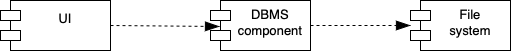

# IT

## **Етап 0**

Ункціональна специфікація _системи управління табличними базами дани_ (СУТБД) у вигляді однієї або кількох діаграм прецедентів **UML**.

## **Етап 1**

Розробити щонайменше 12 UML-діаграм

### Потоки подій до 3-х прецедентів

1. Завантаження з диску

  Передумова: Запуск СУБД
  
  * Користувач вводить назву бази даних
  * Користувач натискає кнопку «Завантажити БД»
  * Відбувається пошук в папці файлу з даною назвою

А3 – альтернативний потік: бд з такою назвою не існує. З’являється вікно, що повідомляє про помилку
А3 1. Користувач натискає «ОК» та повертається до пункту 

  * Відображаються всі таблиці з полями та записами даної бд

2. Створення нової БД

  Передумова: Запуск СУБД
  
  * Користувач вводить назву бази даних
  * Користувач натискає кнопку «Створити БД»
  * У папці створюється файл з розширенням .json з новою бд
  * Створена бд готова до редагування

3. Операція різниця двох таблиць 

  Передумова: відображаються дані бд, над таблицями якої буде здійснюватись операція
  
  * Користувач обирає першу таблицю
  * Користувач натискає кнопку «Різниця таблиць»
  * Користувач обирає другу таблицю
  * Перевіряється наявність спільних полів(з однаковим типом і назвою) 
  * Відображається нова таблиця, що є результатом операції

### Діаграми компонентів

1

2

3

### Діаграма класів

### Діаграма взаємодій для різниці таблиць

### Діаграма діяльності для сворення таблиці

### Діаграма діяльності для завантаження таблиці

### Діаграма діяльності для додавання рядка

### Діаграма розгортання для створення БД

### Діаграма розгортання для різниці таблиць

